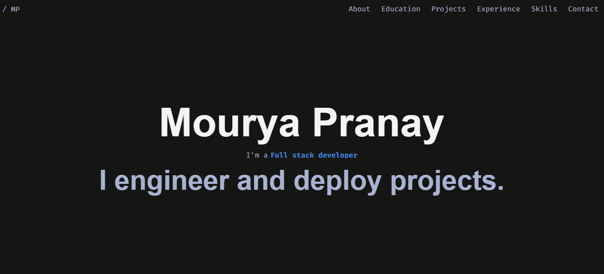

# 🚀 Portfolio []



<div align="center">
    <span style="font-size: 1.5rem;">🛠️ Built With</span>
    <div align="center">
        &nbsp;
        &nbsp;
        &nbsp;
        
    </div>
</div>

## Hey 👋
<div>
    <span>
        Thanks for visiting my site, I hope you like it.
    </span>
    <br />
    <span>
        Working on this project has been very helpful to me in understanding CI/CD pipelines and gain a deeper understanding into CSS styling and designing responsive web pages. I recommend you to develop your own portfolio website and learn to deploy it. Have a great day!
    </span>
</div>

## Prerequisites
Make sure you have the following setup:
- [Git](https://git-scm.com/downloads)
- [Node.js](https://nodejs.org/en/download)
- [npm](https://docs.npmjs.com/downloading-and-installing-node-js-and-npm)

## Installation

#### Clone the repository and navigate into the project directory
```bash
git clone https://github.com/moonbuild/portfolio.git
cd portfolio
```

#### Install dependencies
```bash
npm install
```

#### Start the development server
```bash
npm run dev
````
Once its running, go to:
👉 http://localhost:5173/
